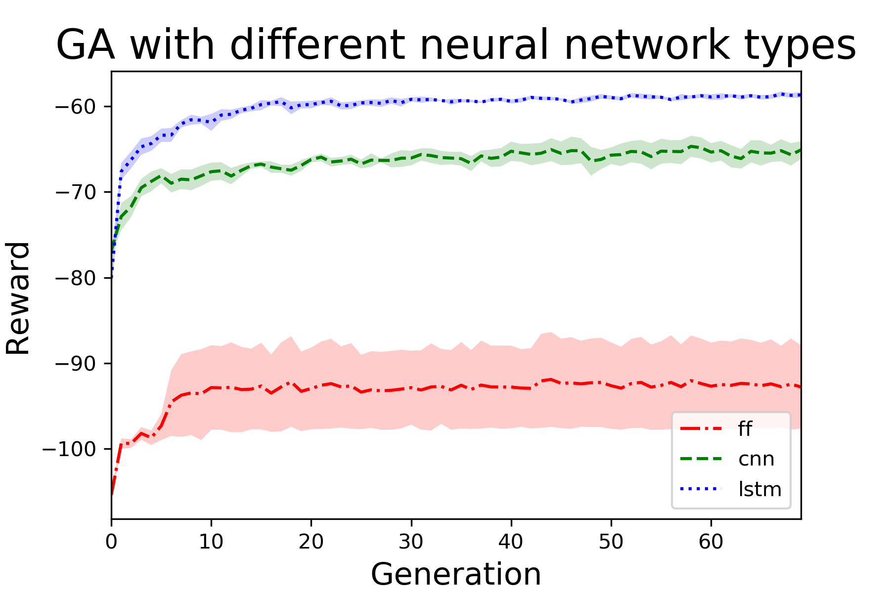
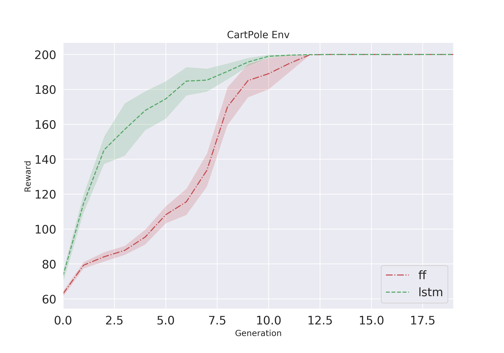
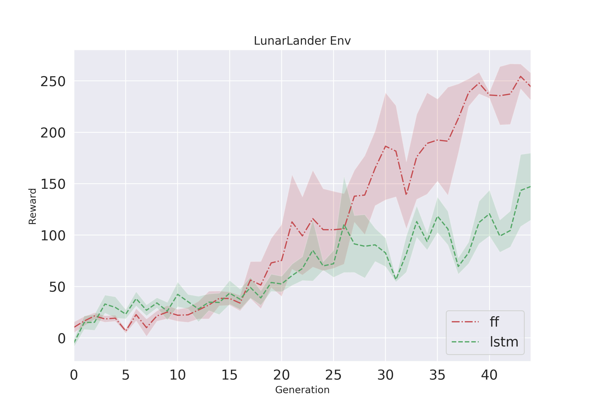

# GARNE
## Genetic Algorithm with Recurrent Network and Novelty Exploration
In this folder a Genetic Algorithm is implemented with several add-ons that can be user specific added to the baseline to improve performance.
Basline simple GA for continuous control tasks.
__________________
#### Add-ons
- using LSTM layer (1D-CNN) 
- adding novelty search to the Algorithm
- adding a crossover method to the mutation (two methods to choose from!)

__________________
#### Run Algorithms:

- to run the Algorithm: `python GARNE.py`

Flags: 

`-env` : "The environment you want to train the algorithm. Default is Damper-v0"

`-ps`  : "Population size. Default is 1001"

`-pc`  : "Parent count, number of top performer of the current generation that build the new generation. Default is 20"

`-g`   : "Maximum number of generations. Default is 10"

`-ls`  : "Layer size, number of nodes per layer. Default is 10"

`-network`   : "Network type, feed forward (ff), convolutional neural network (cnn) or long-short-term-memory (lstm). Default is ff"

`-std`  : "Noise that is added to the networks weight as mutation. Default is 0.1"

`-novelty`   :"Adds novelty to the algorithm. Default is: False. If choosen, be aware to adapt K_NEIGHBORS value and the behavior characterization (bc in GA_Addon/base.py) depending on the task/environment!"

`-crossover`   : "Adds crossover to the creation process of the new population. The user has two crossover methods to choose from: \nMethod 1:  Slices the seeds of both parents in the middle and combines them. keyword argument: 1 \nMethod 2: For each seed in seed_index of both parents. Pick one for the child with a 50/50 prob. keyword argument 2. Default is 0 - No crossover!"

`-worker_count`   : "Numbers of worker that gather training data. Default is 10"

`-save_model` : "Saving the best model after training in the current directory"

`--save_every` : "Saving the best Performer after X generations, default is 10"

**Example**: `python GARNE.py -env CartPole-v0 -g 15 `

__________________
Outputs can be monitored with tensorboard:
`tensorboard --logdir=runs`

If tensorboard is not opening, try with local host flag: 
`tensorboard --logdir=runs --host localhost`

### Performance of GA with different Network Types:
Perfomance of the three different neural network types tested 

#### Performance for CartPole ENV:

#### Performance for LunarLander ENV:

